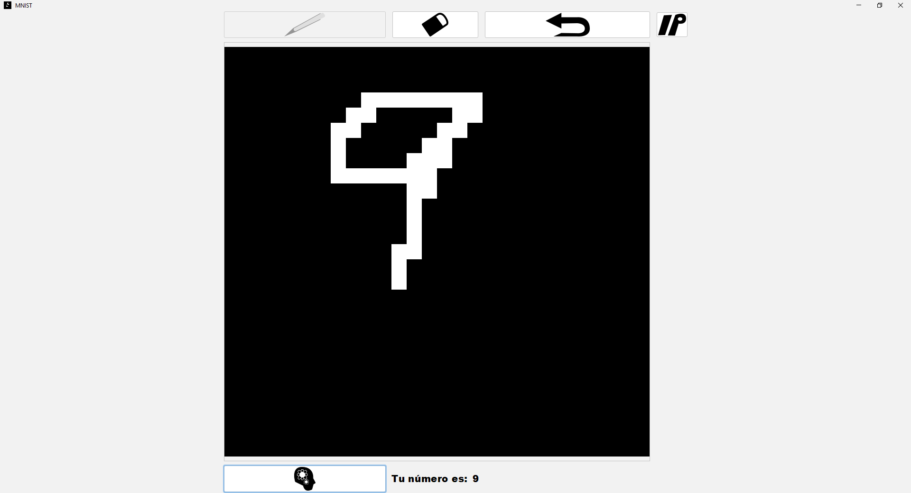
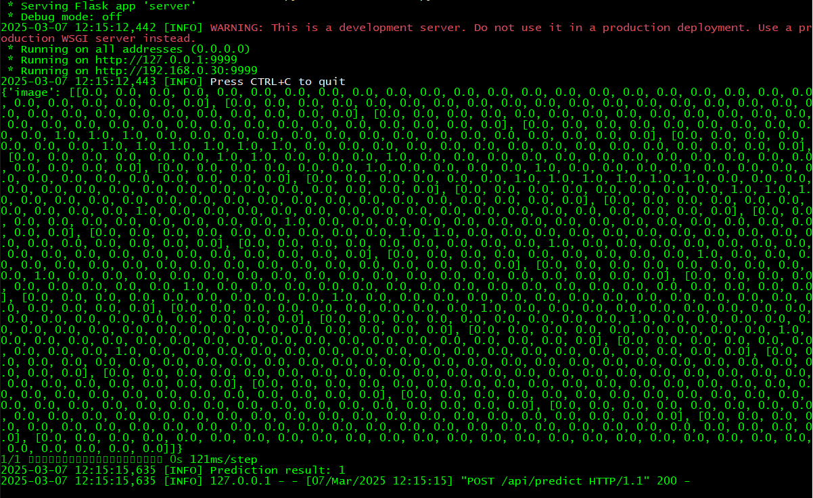

# mnist-example
<hr/>

# Description:
This is an example of how to use the MNIST dataset 
to use a CNN model to make predictions in a "user-friendly" way



<hr/>

# How it works:
The application use python with flask at the back-end
and java with RetroFit at the front-end.

The cliente send the image (a double array of floats) to the server,
where is processed and pass generate the response and send it back to the client



<hr/>

# How to use:
All the executables are in the \bin directory.

First you need to run the python server,
you will find the script in the src/server directory
```
python .\server.pyc
```
you can use this command to run it in your terminal.

then run the jar application
and that's all
